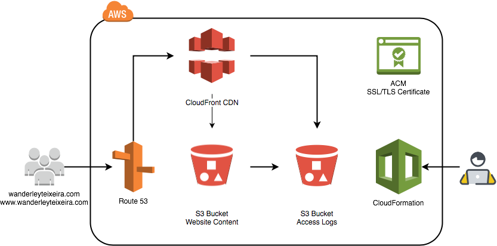

# AWS Static Website - Infrastructure as Code
Infrastructure for static website hosted with S3 and CloudFront with a custom domain.

## Diagram

## Resources Provisioned

* S3 bucket for web site content
* Access logs written to logs bucket
* ACM Certificate for SSL
* CloudFront distributions for website https access
* Rewrite URLs using CloudFront and Lambda@Edge
* Route 53 hosted zone with DNS entries

## Apex Zone

We created an `A` record in Route 53's Hosted Zone, and used its special `ALIAS` feature to connect it to the AWS resource.

## Lambda@Edge

Implemented [Lambda@Edge](https://aws.amazon.com/blogs/compute/implementing-default-directory-indexes-in-amazon-s3-backed-amazon-cloudfront-origins-using-lambdaedge/) to be able to server `Archives/*` from blog since the file `index.html` in the subdirectory level will not be served by CloudFront when the site is hosted in S3. 

### References

Many thanks to [alestic](https://github.com/alestic/aws-git-backed-static-website) and [sjevs](https://github.com/sjevs/cloudformation-s3-static-website-with-cloudfront-and-route-53)
